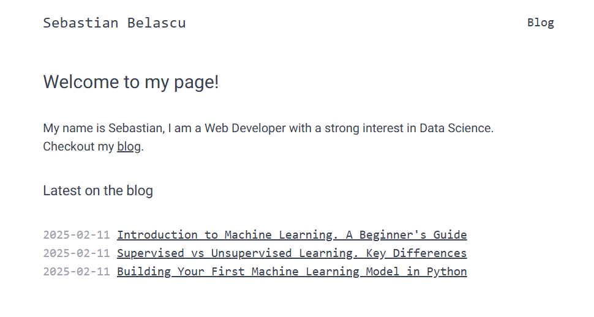

# Blog Project

This is a **static blog** built using **Next.js, MDX, and Frontmatter**. It features:

- **Pagination** for navigating between blog posts.
- **Filtering by date and tags** to display the most recent and relevant content.
- **Latest posts** dynamically shown based on publication date.



## 🚀 Tech Stack
- **Next.js** for the frontend.
- **React** for component-based UI development.
- **MDX** for writing blog posts with JSX support.
- **Frontmatter** for managing metadata in Markdown files.
- **Tailwind CSS** for styling.

## 📂 Project Structure
```
/blog
 ├── pages
 ├── components
 ├── posts (MDX blog posts)
 ├── styles
 ├── public
```

## 📌 Features
- 📄 **Static blog using MDX**
  
- 📆 **Sorts posts by date automatically**
- 🔄 **Pagination for easy navigation**
  
- 🎨 **Minimal design with Tailwind CSS**

---
